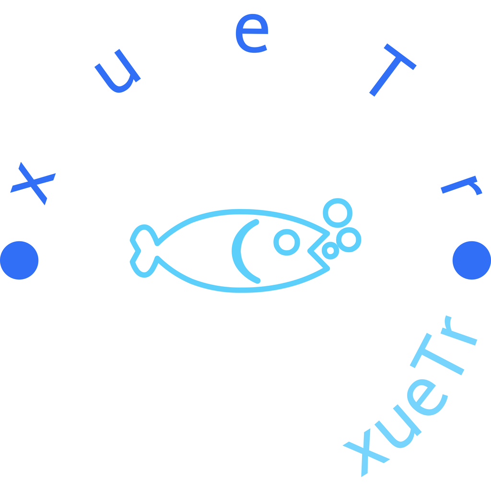
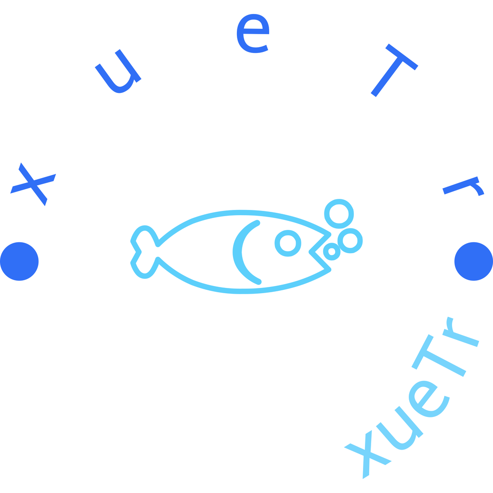

# 使用 Rust 将直角图标变成圆角图标(WASM)

```shell
wasm-pack build --out-dir ./wasm-rounded-icon/src --target web --release
```

## 环境搭建

基础 Rust 环境搭建，参考[此仓库](https://github.com/yuxuetr/rust-template)

## 依赖

- `anyhow`: 使用`?`操作符，代替`.unwrap()`
- `image`: 提供了基本的图像处理功能和转换到各种图像格式的方法。
- `imageproc`: 一个基于`image`的图像处理库。

## 运行

```rust
# /path/to/make-rounded-corner-icons
cargo run
```

## 结果展示

- 原图像



- 处理后的图像(在 Github 显示不出区别，可以下载看看效果)


